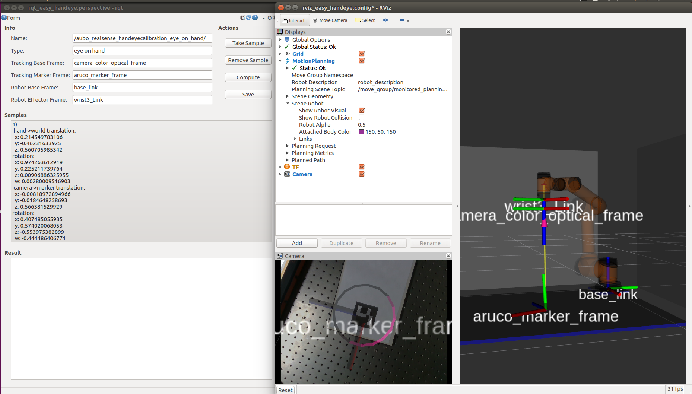
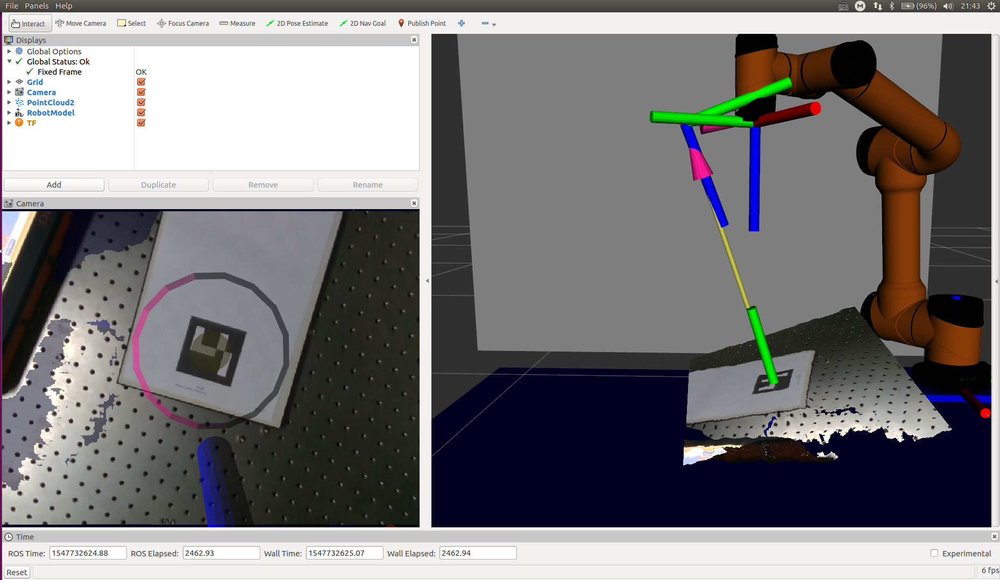
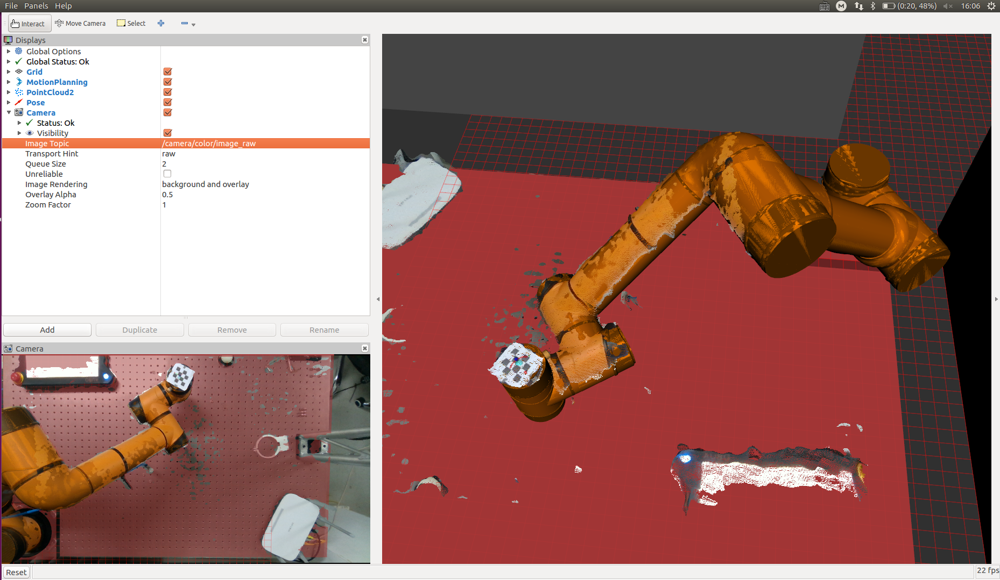

# BionicDL-CobotLearning-Project2
The project is illustrated with Aubo-i5 and realsense 400 series. If you are doing the project with a different robot arm, just replacing the aubo_robot directory with you robot arm's ROS package and lanuch the corresponding moveit group node.

# Project Setup
Before running the project, make sure you've installed ROS kinetic (http://wiki.ros.org/kinetic/Installation/Ubuntu) and catkin_tools (https://catkin-tools.readthedocs.io/en/latest/installing.html).

Please go to the each package under this repository for detailed explanations and installation guidance. Please install the [Realsense SDK](https://realsense.intel.com/sdk-2/#install) and update the [firmware](https://www.intel.com/content/dam/support/us/en/documents/emerging-technologies/intel-realsense-technology/Linux-RealSense-D400-DFU-Guide.pdf) in the realsense before you run the following steps. The realsense ros package in this repository is an old version 2.0.0. If you want to use the latest version, please git clone from the website [here](https://github.com/intel-ros/realsense).

For this setup, catkin_ws is the name of active ROS Workspace, if your workspace name is different, change the commands accordingly
If you do not have an active ROS workspace, you can create one by:
```sh
$ mkdir -p ~/catkin_ws/src
$ cd ~/catkin_ws/
$ catkin build
```

Now that you have a workspace, clone or download this repo into the src directory of your workspace:
```sh
$ cd ~/catkin_ws/src
$ git clone https://github.com/ancorasir/BionicDL-CobotLearning-Project2.git
```

Now install missing dependencies using rosdep install:
```sh
$ cd ~/catkin_ws
$ rosdep install --from-paths src --ignore-src --rosdistro=kinetic -y
```

Build the project:
```sh
$ cd ~/catkin_ws
$ catkin build aubo_msgs
$ catkin build
```

Add following to your .bashrc file:
```
source ~/catkin_ws/devel/setup.bash
```

# Option1: Run easy_handeye calibration
Lauch the following ros nodes, each in a new terminal window.
1. Launch the realse node to publish the color images and point cloud in ROS.
```sh
$ roslaunch realsense2_camera rs_rgbd.launch
```
2. Launch the aubo movegroup node to publish the robot state.
```sh
$ roslaunch aubo_i5_moveit_config moveit_planning_execution.launch sim:=false robot_ip:=192.168.1.101
```
3. Launch the aruco detection node to publish the position and orientation of the aruco marker in rostopic /tf.
```sh
$ roslaunch aruco_ros single.launch
$ cd ~/catkin_ws/src/BionicDL-CobotLearning-Project2/checkerboard_detector/src
$ python publish2tf.py
$ rosrun image_view image_view image:=/aruco_single/result
```
3. (other choice) Launch the checkerboard detection node to publish the position and orientation of the checkerboard in rostopic /tf.
```sh
$ roslaunch checkerboard_detector checkerboard_detector_single.launch
$ cd ~/catkin_ws/src/BionicDL-CobotLearning-Project2/aruco_ros/aruco_ros/src
$ python publish2tf.py
```
4. Launch the easy_handeye node. A Rviz window and a data collection GUI will come up as showed in the picutre below.
```sh
$ roslaunch easy_handeye aubo_realsense_calibration.launch
```
Move the robot arm through the teach pendent. At each robot pose, press the "Take Sample" button to collect the current poses of the robot and marker. Collect about 50 samples and compute the result. Press "Save" button to save the hand-eye matrix to ~/.ros/easy_handeye/aubo_realsense_handeyecalibration_eye_on_hand.yaml. Close the easy_handeye node once you've finish and saved the result. As you can see from the picuture below, the camera is placed below the flange by default.The real position of the camera will be updated once we pusblish the true handeye transformation.


Visualize the calibration result. Go directly to launch the easy_handeye pulish node if you still have the realsense and aruco detection nodes running from the previous calibration step.
```sh
$ roslaunch realsense2_camera rs_rgbd.launch
$ roslaunch aruco_ros single.launch
$ cd ~/catkin_ws/src/BionicDL-CobotLearning-Project2/aruco_ros/aruco_ros/src
$ python publish2tf.py
$ roslaunch aubo_i5_moveit_config moveit_planning_execution.launch sim:=false robot_ip:=192.168.1.101
$ roslaunch easy_handeye publish.launch
$ rosrun rviz rviz -d ~/catkin_ws/src/BionicDL-CobotLearning-Project2/easy_handeye/easy_handeye/launch/aubo_realsense_handeye_result.rviz
```


# Option2: Run hand eye calibration by stick a checkerboard on the center of the flange of the robot arm
The calibration results of the above methods is not good enough for usage. We recommend option2 method if you have you camera installed fixed reference to the robot base.
1. Launch the robot's movegroup node to monitor, control and visualize the robot. Please check the ip of you robot and replace the default value below.
```sh
$ roslaunch aubo_i5_moveit_config moveit_planning_execution.launch sim:=false robot_ip:=192.168.1.101
```
2. Print a checkerboard of the size similar to the robot tool flange and stick it into the tool flange.
3. Complete the python script of collect calibration data. When finished, run:
```sh
$ python collect_calibration_data.py
```
4. Complete the python script of calculate the hand eye transformations from the collected data and publish the transformation to /tf. When finished, run:
```sh
$ python calculate_publish_handeye_matrix.py
```
5. Visualize the calibration result.
```sh
$ roslaunch realsense2_camera rs_rgbd.launch
```


# Write and run the perception ros node
6. Complete the python script of a ROS node subscribing to the color and depth image topics of realsense. Finish the TODO part in /BionicDL-CobotLearning-Project2/aubo_robot/aubo_i5_moveit_config/scripts/project_grasp.py
